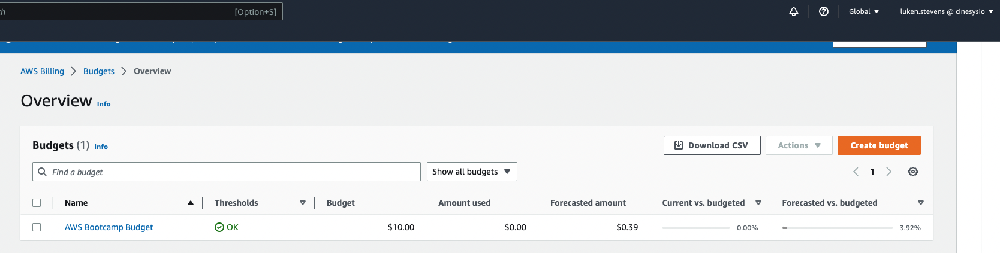
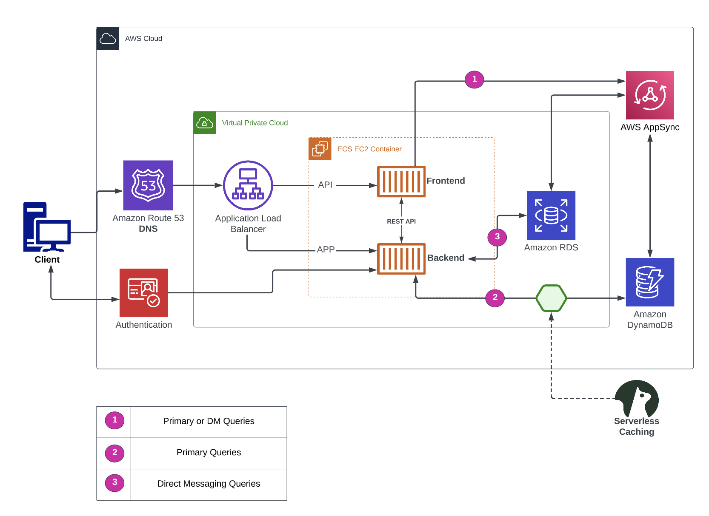

# Week 0 — Billing and Architecture

## Required Homework/Tasks

### Create an AWS Budget of $10

### Created an AWS Billing Alert via Cloudwatch

### Create an SNS

## Create a Logical Architectural Diagram with Lucid Charts

[Here is a link to the diagram:](https://lucid.app/lucidchart/2d9b84d0-77c0-45ba-bb3a-1301c31dbf0b/edit?viewport_loc=-631%2C-234%2C3500%2C2928%2C0_0&invitationId=inv_21e397a6-59fb-44ac-8721-26509a24c2c0)
